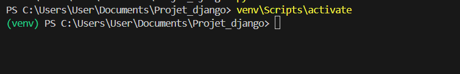
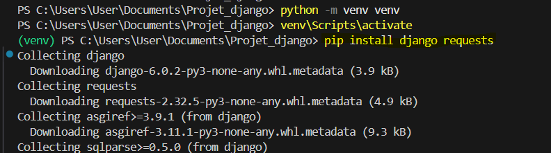
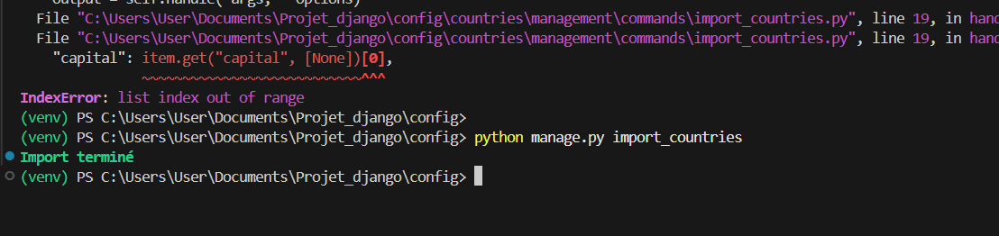
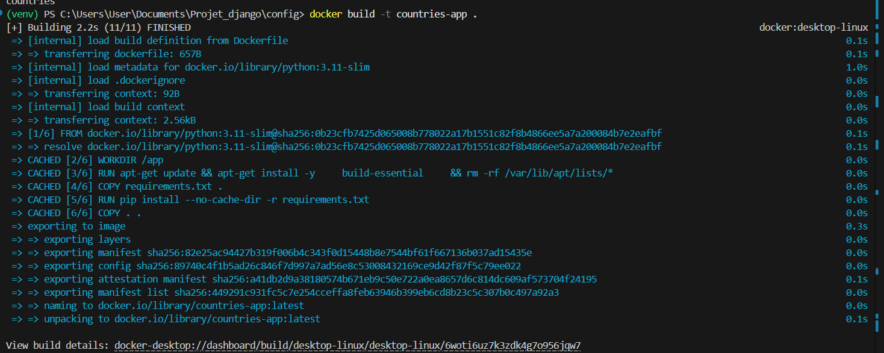

# Django Countries Project

Application Django permettant d’importer des données depuis l’API **REST Countries**, de les stocker en base locale, puis de les exploiter via une interface web et des statistiques métier.

> Règle clé du projet : **aucune page web n’appelle l’API**.  
> Toutes les données affichées proviennent exclusivement de la base de données locale(SQLITE)

---


## Installations 
### Prérequis

- Python 3.10 ou supérieur  
- Django 

### vérification de l'installation de python et pip 
```bash
python --version
pip --version
```

#### Création de l’environnement virtuel
```bash
python -m venv venv
```


#### Activation de l’environnement virtuel
```bash
venv\Scripts\activate

```


### Installation des dépendances

```bash
pip install django requests

```


### Initialisation de la base de données
```bash

python manage.py makemigrations 

python manage.py migrate 
```

### Import des données pays 


L’import est idempotent : relancer la commande ne crée pas de doublons grâce à l’utilisation de `update_or_create`.

### Lancer le serveru Django 
```bash
python manage.py runserver 

```
## Exécution avec Docker

### Build de l’image Docker
```bash
docker build -t countries-app . 
```



### Lancer le conteneur 
``` bash 
docker run -d -p 8000:8000 --name countries countries-app 

```
### Initialisation de la base et import
```bash
python manage.py makemigrations 
docker exec -it countries python manage.py migrate
docker exec -it countries python manage.py import_countries
```

### Accès à l'application
```bash
http://127.0.0.1:8000 
```


## URLs disponibles

| URL | Description |
|----|------------|
| `/countries/` | Liste des pays (pagination, filtres, recherche) |
| `/countries/<cca3>/` | Détail d’un pays |
| `/countries/stats/` | Statistiques globales |

---

## Statistiques affichées

- Nombre total de pays  
- Top 10 pays par population  
- Top 10 pays par superficie  
- Répartition des pays par région  

---

## Tests unitaires (bonus)

### Exécution des tests en local

```bash
python manage.py test

```

### Exécution des tests avec docker

```bash
docker exec -it countries python manage.py test  

```
